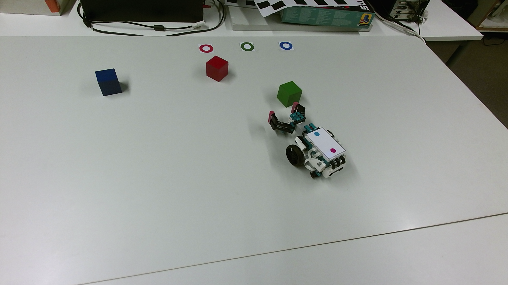

## Computer Vision Practical Assignment
This is the group project for Computer Vision university course. The setting of this final project of the course contains a robot, a camera, 3 colored cubes (red, green, blue) and their respective target locations. The goal is to localize the cubes and bring them to their target locations with the robot. The problem has 3 stages: calibration, object detection and guiding the robot.

### Calibration
In calibration (file calibrate.m), DLT is used to find the projection matrix between 2D image coordinates captured by the camera and 3D world coordinates. The user is prompted to manually choose the correct points from the image for calibration.

### Object detection
For object detection, we use color tresholding to filter different colors in the image and regionprops to detect the cubes and their circular target locations, plus the cyan and magenta dots on top of the robot to find the robot pose. This is done in file find_objects.m 

### Guiding the robot
We have 2 files for deciding and giving instructions to the robot. move_block.m provides the most simple instructions, only taking into account the robot pose and the location of the cube and its target. Then it calculates the angles and distances the robot needs to move to go to the cube, grab it, go to te target and let go of the cube. The cube color is given as a parameter. In move_block_pathfinding.m, we have implemented a very simple obstacle avoidance (which however is not very robust and would not work as a pathfinding algorithm in a "real life" setting).

Below is an image of the scene.

